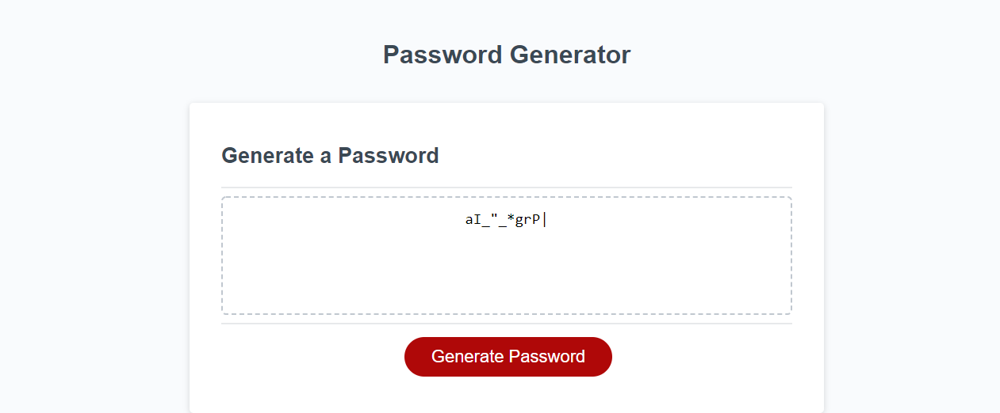

# Password-Generator-JavaScript
In this repo you will find a refactored website to include a password generator script

# Introduction

Really one of those 'Does what it says on the tin' projects. 
However, bellow is a brief explanation to what this project is all about.

This is a small javascript password generator which is available to be used.
The User can choose a password length between 8 and 128 (both inclusive) and can choose what sets of characters to include out of the following choices:
    - lowercase
    - uppercase
    - numbers
    - [special characters](https://www.owasp.org/index.php/Password_special_characters)

## User Story

```
AS AN employee with access to sensitive data
I WANT to randomly generate a password that meets certain criteria
SO THAT I can create a strong password that provides greater security
```

## Acceptance Criteria

```
GIVEN I need a new, secure password
WHEN I click the button to generate a password
THEN I am presented with a series of prompts for password criteria
WHEN prompted for password criteria
THEN I select which criteria to include in the password
WHEN prompted for the length of the password
THEN I choose a length of at least 8 characters and no more than 128 characters
WHEN prompted for character types to include in the password
THEN I choose lowercase, uppercase, numeric, and/or special characters
WHEN I answer each prompt
THEN my input should be validated and at least one character type should be selected
WHEN all prompts are answered
THEN a password is generated that matches the selected criteria
WHEN the password is generated
THEN the password is either displayed in an alert or written to the page
```

## Comments
Reference to line 17 in the js code and its deserved explanation:
    I am aware Number(stringToConvert) is availible to be used but via some testing i realised that it sometimes caused some issues
    When dealing unpredictable user input I always try and edge on the side of catuion and after some research i found that using unary operators is very safe as they are[" really happy to throw a NaN if they see anything funky"](https://coderwall.com/p/5tlhmw/converting-strings-to-number-in-javascript-pitfalls#:~:text=really%20happy%20to%20throw%20you%20a%20NaN%20value%20if%20they%20see%20anything%20funky)
    I also found that they provide some performance benefits.
    If you wish to discuss this matter further with, feel free to contact me [HERE](https://stackoverflow.com/users/13616697/lewy192)

Both Psuedocode files were used before i wrote the script.js file. They are mainly for my personal reference but please feel free to have a look if you desire.

## ChangeLog
 - Changed the provided file structure.

## Screenshot

## Live Version

[Here](https://lewy192.github.io/Password-Generator-JavaScript/) you will find the live deployed version thanks to GitHub Pages.

## Acknowledgements
 - [General Research](https://www.w3schools.com/)
 - [Converting Strings to Number in Javascript: Pitfalls](https://coderwall.com/p/5tlhmw/converting-strings-to-number-in-javascript-pitfalls)
 - [String concat javascript](https://web.archive.org/web/20170404182053/https://jsperf.com/concat-vs-plus-vs-join)
 - [Special Characters](https://www.owasp.org/index.php/Password_special_characters)
